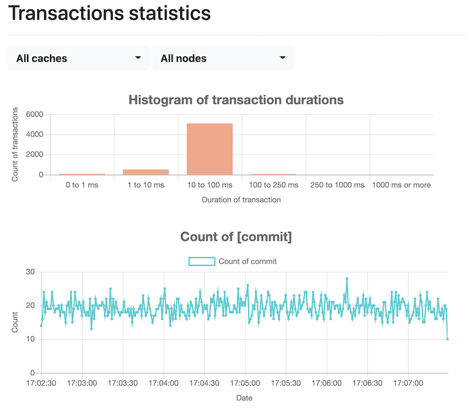

# Apache Ignite 2.10: Thin Client Expansion

As of March 15, 2021, [Apache Ignite](https://ignite.apache.org/) 2.10 has been released. You can directly check the 
full list of resolved [Important JIRA's](https://s.apache.org/i3ny6) but here let’s briefly overview some valuable 
improvements.


## Thin Clients

Thin clients now support several important features which, previously were available only on the thick clients.
Thin clients are always backward and forward compatible with the server nodes of the cluster, so the cluster upgrade 
process will be more convenient if the lack of these features prevented you from doing that. 

See the list of what is changed for thin clients below:
* Transactions
* Service invocations
* Continuous Queries
* SQL API
* Cluster API
* Cache Async API
* Kubernetes Discovery (_ThinClientKubernetesAddressFinder_)

You may check the [List of Thin Client Features](https://cwiki.apache.org/confluence/display/IGNITE/Thin+clients+features) 
that supported by platforms you are interested in or see the [What's new in Apache Ignite.NET 2.10](https://ptupitsyn.github.io/Whats-New-In-Ignite-Net-2.10/).

## Cluster Monitoring

Apache Ignite self-monitoring and cluster health check subsystems are also extended by additional SQL-views 
and command line scripts.

### New _control-script_ Commands

Query any of the available system views.

```shell
control.sh --system-view views
Command [SYSTEM-VIEW] started
--------------------------------------------------------------------------------
name                           schema    description
SQL_QUERIES_HISTORY            SYS       SQL queries history.
INDEXES                        SYS       SQL indexes
BASELINE_NODES                 SYS       Baseline topology nodes
STRIPED_THREADPOOL_QUEUE       SYS       Striped thread pool task queue
SCAN_QUERIES                   SYS       Scan queries
PARTITION_STATES               SYS       Distribution of cache group partitions across cluster nodes

Command [SYSTEM-VIEW] finished with code: 0
--------------------------------------------------------------------------------
```

Query any of the available system metrics.

```shell
[source, text]
control.sh --metric sysCurrentThreadCpuTime
Command [METRIC] started
--------------------------------------------------------------------------------
metric                          value
sys.CurrentThreadCpuTime        17270000
Command [METRIC] finished with code: 0
--------------------------------------------------------------------------------
```

[Read More](https://ignite.apache.org/docs/latest/tools/control-script)

### Managing Ignite System Properties

In addition to basic cluster configuration settings, you can perform some low-level cluster configuration and tuning via 
Ignite system properties. Run the command below to see the list of all available system properties for configuration:

```shell
$./ ignite.sh -systemProps

--------------------------------------------------------------------------------
IGNITE_AFFINITY_HISTORY_SIZE           - [Integer] Maximum size for affinity assignment history. Default is 25.
IGNITE_ALLOW_ATOMIC_OPS_IN_TX          - [Boolean] Allows atomic operations inside transactions. Default is true.
IGNITE_ALLOW_START_CACHES_IN_PARALLEL  - [Boolean] Allows to start multiple caches in parallel. Default is true.
...
--------------------------------------------------------------------------------
```

[Read more](https://ignite.apache.org/docs/latest/setup#setting-ignite-system-properties)

## Cluster Profiling

From now on, Apache Ignite is delivered with the cluster profiling tool. This tool collects and processes all cluster
internal information about Queries, Compute Tasks, Cache operations, Checkpoint and WAL statistics, and so on for 
problem detection and cluster self-tuning purposes. Each cluster node collects performance statistics into a special
binary file that is placed under the `[IGINTE_WORK_DIR]/perf_stat/` directory with the template filename as 
`node-[nodeId]-[index].prf`.
All these files are consumed by offline-tool that builds the report in a human-readable format.

[Read More](https://ignite.apache.org/docs/latest/monitoring-metrics/performance-statistics)




## Transparent Data Encryption - Cache Key Rotation

Payment card industry data security standard (PCI DSS) requires that key-management procedures include a predefined 
crypto period for each key in use and define a process for key changes at the end of the defined crypto period. 
An expired key should not be used to encrypt new data, but it can be used for archived data, such keys should be 
strongly protected (section 3.5 - 3.6 of PCI DSS Requirements and Security Assessment Procedures).

Apache Ignite now supports full PCI DSS requirements:
* _Transparent Data Encryption_ available since the 2.7 release.
* _Master Key Rotation_ procedure available since the 2.9 release.
* _Cache Key Rotation_ procedure available since the 2.10 release. 

You may use the CLI tools that provide the ability to change the re-encryption rate as well as suspend and 
resume background re-encryption at runtime.

[Read More](https://ignite.apache.org/docs/latest/security/cache-encryption-key-rotation)
