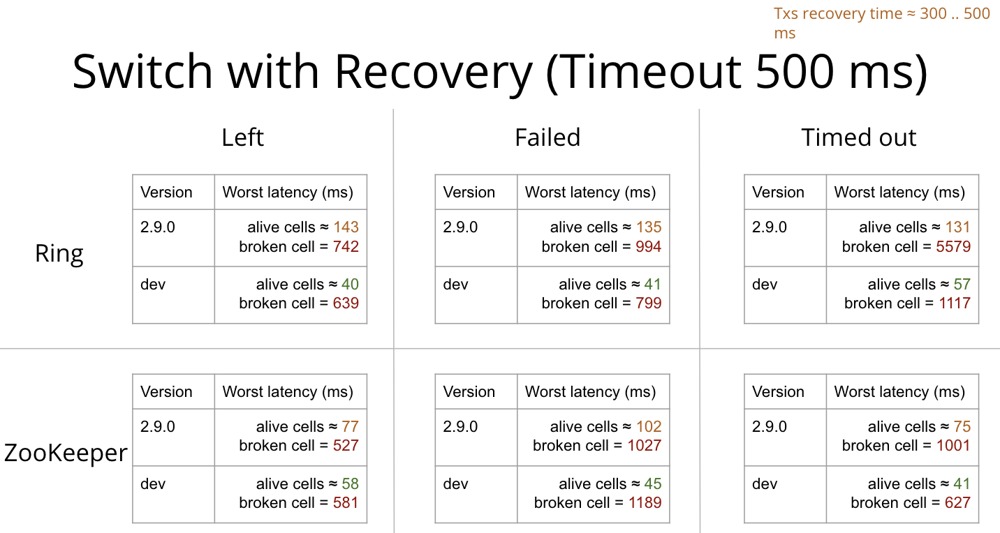

# Apache Ignite 2.11: Stabilization First

The new [Apache Ignite](https://ignite.apache.org/) 2.11 was released on September 17, 2021. It can be considered to a greater 
extent as a stabilization release that closes more technical debts of the internal architecture and bugs. Out of more than 
200 completed tasks, 120 are bug fixes. However, some valuable improvements still exist, so let's take a quick look at them together.


## Thin Clients

Partition awareness is enabled by default in the 2.11 release and allows the thin client to send query requests directly to the 
node that owns the queried data. Without partition awareness, an application executes all queries and operations via 
a single server node that acts as a proxy for the incoming requests.

The support of continuous queries are added to the java thin client. For the other supported features you may check the 
[List of Thin Client Features](https://cwiki.apache.org/confluence/display/IGNITE/Thin+clients+features).


## Cellular-clusters Deployment

The Apache Ignite internals has the so-called the `switch` (a part of Partition Map Exchange) process that is used to perform
atomic execution of cluster-wide operations and moving the cluster from one consistent state to another e.g. cache creation/destroy,
a node JOIN/LEFT/FAIL operations, snapshot creation, etc. During the switching process, all user transactions are parked for a small
period of time which in turn increased the average latency and throughput of the overall cluster.

Splitting the cluster into virtual cells containing 4-8 nodes may increase the total cluster performance and minimize the
influence of one cell on another in case of node fail events. Such a technique also significantly increase transactions recovery 
speed on cells not affected by failing nodes.

From now on you can use the `RendezvousAffinityFunction` affinity function with the `ClusterNodeAttributeColocatedBackupFilter` to
group nodes into virtual cells. Since the node baseline attributes are used as cell markers the corresponding 
[BASELINE_NODE_ATTRIBUTES](https://ignite.apache.org/docs/latest/monitoring-metrics/system-views#baseline_node_attributes) system
view was added.

See benchmarks below which represent the worst (max) latency that happens in case of node left/failure/timeout events on broken 
and alive cells.




## New Page Replacement Algorithms

Currently, pages rotation between page-memory (so-called the page replacement procedure) Apache Ignite uses the Random-LRU algorithm.
This algorithm has a low maintenance cost, but it has many disadvantages and greatly affects the performance when the page replacement 
is started. On some deployments, administrators even force a cluster restart periodically to avoid page replacement. 
There are a few new algorithms available from now on.

### Segmented-LRU Algorithm

It is a scan-resistant modification of the LRU algorithm. The pages list is divided into two segments. Pages in each segment are 
ordered from the least to the most recently accessed. New pages are added to the most recently accessed end (tail) of the probationary 
segment. Existing pages are removed from wherever they currently reside and added to the most recently accessed end of the protected 
segment. Page to replace is polled from the least recently accessed end (head) of the probationary segment.

### CLOCK Algorithm

The CLOCK algorithm keeps a circular list of pages in memory, with the "hand" pointing to the last examined page frame in the list. 
When a page fault occurs and no empty frames exist, then the hit flag of the page is inspected at the hand's location. If the hit 
flag is 0, the new page is put in place of the page the "hand" points to, and the hand is advanced one position.


## Snapshot Restore And Check Commands
### Check

All snapshots are fully consistent in terms of concurrent cluster-wide operations as well as ongoing changes with Ignite.
However, in some cases and for your own peace of mind it may be necessary to check the snapshot for completeness and 
for data consistency. The Apache Ignite now is delivered with built-in snapshot consistency check commands that enable you to 
verify internal data consistency, calculate data partitions hashes and pages checksums, and print out the result if a problem 
is found. The check command also compares hashes calculated by containing keys of primary partitions with corresponding backup 
partitions and reports any differences.

```shell
# This procedure does not require the cluster to be in the idle state.
control.(sh|bat) --snapshot check snapshot_name
```

### Restore

Previously, only the manual snapshot restore procedure have been available by fully copying persistence data files from the 
snapshot directory to the Apache Ignite `work` directory. The automatic restore procedure allows you to restore cache groups from
a snapshot on an active cluster by using the Java API or command line script (using CLI is recommended).  Currently, the restore 
procedure has several limitations, so check the documentation pages for details.

```shell
Start restoring all user-created cache groups from the snapshot "snapshot_09062021".
control.(sh|bat) --snapshot restore snapshot_09062021 --start

# Start restoring only "cache-group1" and "cache-group2" from the snapshot "snapshot_09062021".
control.(sh|bat) --snapshot restore snapshot_09062021 --start cache-group1,cache-group2

# Get the status of the restore operation for "snapshot_09062021".
control.(sh|bat) --snapshot restore snapshot_09062021 --status

# Cancel the restore operation for "snapshot_09062021".
control.(sh|bat) --snapshot restore snapshot_09062021 --cancel
```
