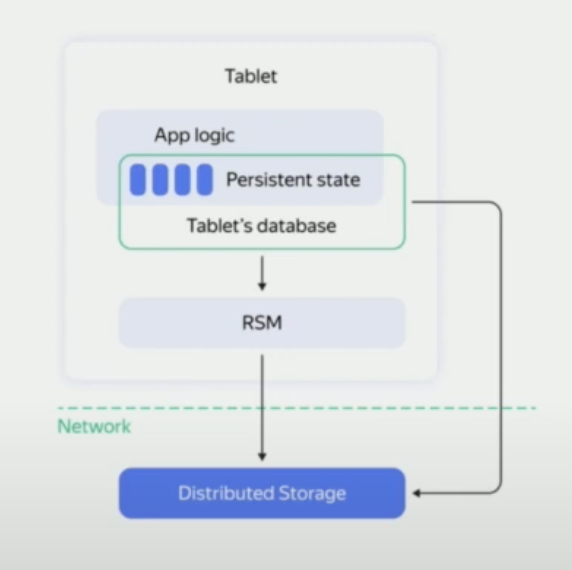
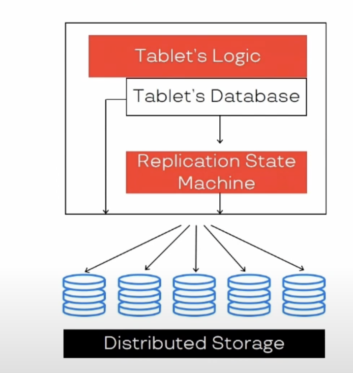
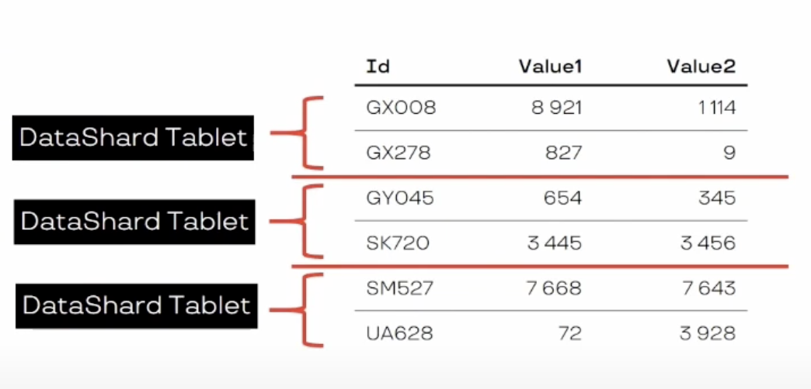

Resources:
- [Oleg Bondar - Serverless YDB Internals](https://www.youtube.com/watch?v=aL9NHR0i0Xs)
- [Andrey Fomichev - YDB: multiversionality in a distributed base](https://www.youtube.com/watch?v=k2ccFXWdBN4)

**Key Takeaways**

Tablet is a statefull abstraction layer that is responsible for (depending on its type) having a view on a portion
of the data in distributed storage, balancing the load by slicing, merging, moving tablets between the nodes,
and providing the transactional guarantees in order to serve the **high availability** and **low latency** for the
workloads, responsible for writing a WAL log for durability.

Key features of the tablets:
- **Replication State Machine (RSM)** writing the WAL log to preserve the state, restoring the state from the log, and
  providing guarantees like Raft or Paxos.
- **ACID transaction guarantees** and storing the data as the LSM-tree.
- **Providing API** for the layer above to interact with the tablet, e.g. insert, update, delete, etc.

##### The tables overview

##### The tablet internals

##### An example of the data-shard tablet

