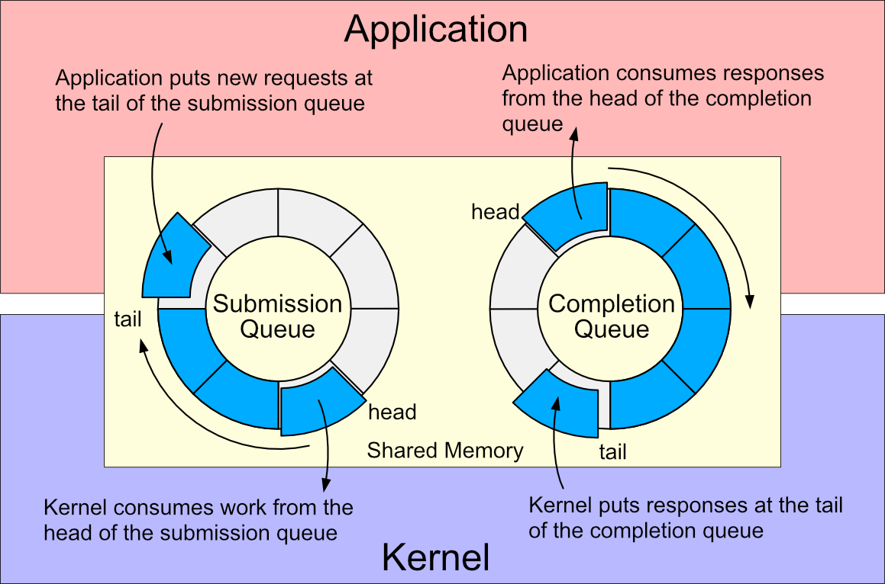
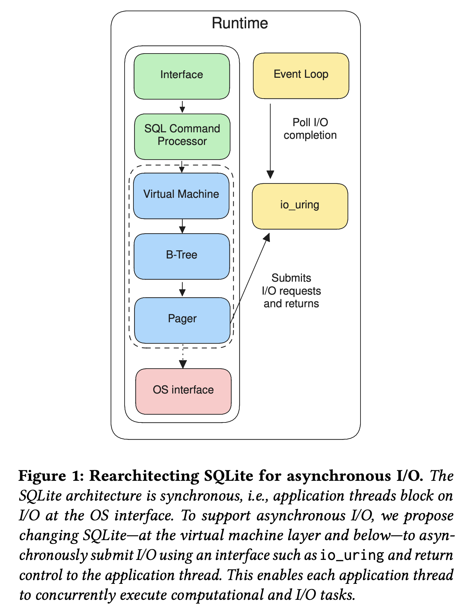

Resources:

[SQLite: Serverless Runtime / Database Co-Design With Asynchronous I/O](https://dl.acm.org/doi/pdf/10.1145/3642968.3654821)

**Key Takeaways**

- The `io_uring` is a **Linux kernel** feature that provides a **high-performance** interface for **asynchronous I/O**. \
  See: [RedHat: Why you should use io_uring for network I/O](https://developers.redhat.com/articles/2023/04/12/why-you-should-use-iouring-network-io)
- Leveraging `io_uring` for asynchronous I/O can still guarantee durability, the database enforces proper barriers and 
flush semantics. How the **durability** of the database could be achieved the same way as with synchronous I/O:
    - Durability is guaranteed when the database layer explicitly issues asynchronous flush commands 
      (e.g., `IORING_OP_FSYNC`) after writing WAL records. 
    - The `io_uring`’s concurrency allows overlapping of compute and I/O, and allows the database to multitask while I/O 
      is in progress. The final commit durability still depends on waiting for the completion queue event
      signifying the flush is done.

See also:

  