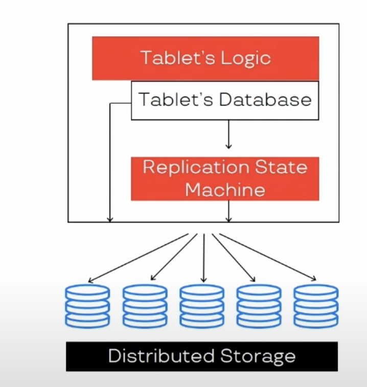

**Last updated: 2024-11-24**

The links to white papers, articles, and other resources related to the database internals, distributed databases.
The resources are listed in the order of my personal investigation and interest in the topic.

* TOC
{:toc}

---

#### Andy Pavlo — The official ten-year retrospective of NewSQL databases (2022)
Resource: 

https://www.youtube.com/watch?v=LwkS82zs65g

Key Takeaways:

- **Selling a new OLTP** distributed database startup **is hard** because it is a product of a high-risk. \
In comparison, the OLAP distributed database startup is a low-risk due to the impact of the running queries on the business 
(e.g. no one loses the revenue if the query is slow).
- 5 key points of the NewSQL databases [1][2] :
  - **Distributed transactions** ACID support for transactions
  - **SQL** (not NoSQL) as a primary interface for the database
  - **Scale-out** (not scale-up)
  - **Consistency** - non-locking concurrency control
  - **Performance** - high per-node performance
- **Shared-nothing architecture** is a key to the NewSQL databases, but it is not a panacea. In the opposite side, the 
shared-disk architecture is also viable for the OLTP databases (e.g. Google Spanner, NeonDB).
- **Middleware solutions** was a big trend in the 2010s, but they were not successful and **were squeezed out** by 
the cloud providers and the NewSQL databases.
- **Automation** of the database management **is a key** to the success of the NewSQL databases, whatever architecture 
they are based on for the next decade.

> The NewSQL Databases == Distributed databases with ACID transactions and SQL interface.

1. [Stonebraker on NoSQL and Enterprises](https://dl.acm.org/doi/pdf/10.1145/1978542.1978546)
2. [Stonebraker on Data Warehouses](https://dl.acm.org/doi/pdf/10.1145/1941487.1941491)

---

#### Calvin — fast distributed transactions for partitioned database systems
Resource: 

https://dl.acm.org/doi/10.1145/2213836.2213838

Thoughts:

- Move as much work as possible earlier in the transaction to avoid the bottleneck of the sequencer and **out of the
transaction boundaries**.
- **Artificial delays to enforce tx order.** Nondeterministic execution of transactions in a distributed databases can arbitrarily reorder the transactions maximizing
the resource utilization, deterministic execution is a key concept in the Calvin database system, which respects the
**sequencer's order** of the transactions, but introduces **artificial delays** for the scheduler to enforce the order.
- **Slow-storage and network delays handle the same.** Calvin's transaction throughput is unaffected by the presence of transactions that access slow storage nodes or 
that are access remote data partitions via the network. 
- **Predict latencies in order to enforce deterministic execution.** The Calvin system uses the **predictive latency** 
to enforce the deterministic execution of the transactions both for the local and remote transactions. The sequencer
must track which keys are in-memory and which are on-disk on all storage nodes to predict the latencies.

Key Takeaways:

- The sensitivity of the overall system throughput depends on two factors:
  - **The number of machines** in the system as for every multi partition transaction the system adds an overhead of:
  serealizing and deserealizing read requests, context switching between transaction to wait for the responses, setting 
  up, executing and cleaning up the transactions context.
  - **The level of contention**. The higher the contention the more likely each machine's slowdown will affect the overall
  system throughput as it cause the other machines to slow down their transaction processing as well. 
  

---

#### Serverless Yandex Database Internals

Resources: 
- [Oleg Bondar - Serverless YDB Internals](https://www.youtube.com/watch?v=aL9NHR0i0Xs)
- [Andrey Fomichev - YDB: multiversionality in a distributed base](https://www.youtube.com/watch?v=k2ccFXWdBN4)

**Key Takeaways**

Tablet is a statefull abstraction layer that is responsible for (depending on its type) having a view on a portion 
of the data in distributed storage, balancing the load by slicing, merging, moving tablets between the nodes,
and providing the transactional guarantees in order to serve the **high availability** and **low latency** for the
workloads, responsible for writing a WAL log for durability.

Key features of the tablets:
- **Replication State Machine (RSM)** writing the WAL log to preserve the state, restoring the state from the log, and
providing guarantees like Raft or Paxos.
- **ACID transaction guarantees** and storing the data as the LSM-tree.
- **Providing API** for the layer above to interact with the tablet, e.g. insert, update, delete, etc.

##### The tables overview

##### The tablet internals

##### An example of the data-shard tablet

#### Distributed Database Architectures + DataStax JVector Talk (CMU Intro to Database Systems)

Resources:

[#22 - Distributed Database Architectures + DataStax JVector Talk (CMU Intro to Database Systems)](https://www.youtube.com/watch?v=o7bjRUcDMx0)

**Key Takeaways**

From my point of view, this is an additional resource to polish the knowledge you already might have
about the distributed databases and their architectures. The most interesting part is about _JVector_ part and 
is outlined below:

- Basic overview of the distributed architectures: **Shared-Nothing**, **Shared-Disk**, **Shared-Memory**. \
Raw and limited examples of the real database engines that are based on these architectures.
- Basic knowledge about partitioning **vertical** and **horizontal**, consistent hashing, 
along with the description of their purpose.
- **Watch Jonathan Ellis' part** where he describes the **JVector** and white papers behind it:
  - [Efficient and robust approximate nearest neighbor search using Hierarchical Navigable Small World graphs](https://arxiv.org/abs/1603.09320)
  - [Understanding Hierarchical Navigable Small Worlds (HNSW)](https://www.datastax.com/guides/hierarchical-navigable-small-worlds)
  - [LM-DiskANN: Low Memory Footprint in Disk-Native Dynamic Graph-Based ANN Indexing (2019)](https://cse.unl.edu/~yu/homepage/publications/paper/2023.LM-DiskANN-Low%20Memory%20Footprint%20in%20Disk-Native%20Dynamic%20Graph-Based%20ANN%20Indexing.pdf)
  - Quicker ADC (Asymmetric Distance Computation) for the ANN search.
  - Product Quantization (PQ) for the ANN search.
  - It was notices that **JVector** implementations with **GC-based languages like Java are more efficient** 
  than the C++ implementations due to the garbage collection and memory management. \
  _Would be interesting to investigate the reasons behind this statement._